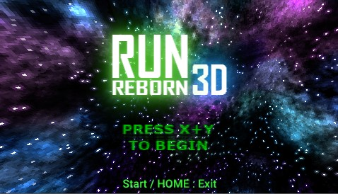

A demo I made to test out the Octave game engine: https://github.com/mholtkamp/octave/
RunReborn3D is based on the old Run series of flash games, RunReborn3D has several enhancements, such as true 3D and true perspective, level rotation control and a new soundtrack.

### Features
 - 11 new levels
 - All-New technical platforming; player controls map rotation.
 - All assets besides the original run symbols made by me.
 - Scripted in Lua, with dynamically-loading infinite level chunk system using instanced scenes.
 - Original Soundtrack made in LMMS.
 - All assets besides the original run symbols made by me.
 - Tested on PC, Wii and 3DS. (DevKitPro/DevKitPPC builds included in release)

### Controls (All platforms)
 - Left Stick / Circle Pad (3DS) / Nunchuk (Wii) : Jump
 - A / B : Jump
 - L / C(Wii) : Rotate map Left
 - R / Z(Wii) : Rotate map Right

### Known Issues
 - Wii version currently takes a long time to boot due to asset loading.
 - The 3DS Lighting differs from PC lighting. This is a hardware issue, possibly resolved in next ovtave update.
